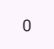
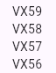

# Vehicle Garage

Aside from a sample increment feature, hold features related with vehicle garage.

- [Release Notes](documentation/release%20notes.md)


## Public Widgets


### Increment Feature

<table>
<tr>
<td>Description</td>
<td>Code Snippet</td>
<td>Render</td>
<td>Data Transfers</td>
</tr>
<tr>
<td>
Increment Counter Button
</td>
<td>

```dart
IncrementCounterWidget()
```

</td>
<td>


</td>
<td>N/A</td>
</tr>
<tr>
<td>
On counter change
</td>
<td>

```dart
OnCounterChangeWidget(
  builder: (context, value) {
    return Text(value.toString());  
  }
)
```

</td>
<td>



</td>
<td>N/A</td>
</tr>
</table>

### Garage Feature

<table>
<tr>
<td>Description</td>
<td>Code Snippet</td>
<td>Render</td>
<td>Data Transfers</td>
</tr>
<tr>
<td>
Garage List
</td>
<td>

```dart
GarageWidget()
```

</td>
<td>


</td>
<td>

Produces on selection:
```dart
class Vehicle {
  final String vin;
  final String brand;
  final List<Capability> capabilities;

  Vehicle({
    required this.vin,
    required this.brand,
    this.capabilities = const [],
  });
}

class Capability {
  final String name;
  Capability({required this.name});
}
```
</td>
</tr>
</table>

## Inversion Of Control

```dart
// Module for Increment Feature
IncrementModule(),
// Module for Garage Feature
GarageModule()
```
